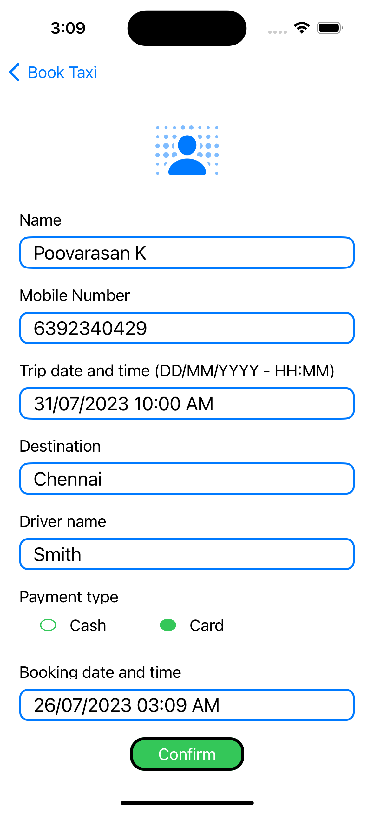
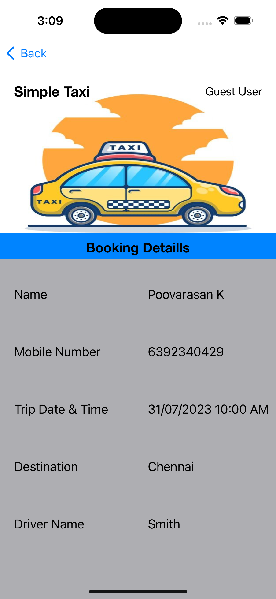

# SimpleTaxiBookingApp

A taxi booking application using `Swift` and `Google Map`.
It is an iOS application. using the Swift programming language. 

## Features

-   Google Map SDK is enabled. Pin the user's current location and driver's location on the map view.
-   Indicates the action of updating the user's current location.
-    User information form to get user name, phone number, travel date and time, destination, payment type.
-    Book a nearby driver and a minimum reasonable amount to book a taxi.

## Screenshots

### User mobile app

    
View Screenshots

     

|  |  |  |
| :---:  | :---:  | :---:  |
|    |    |  

  
